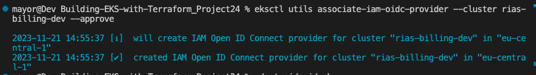
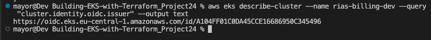
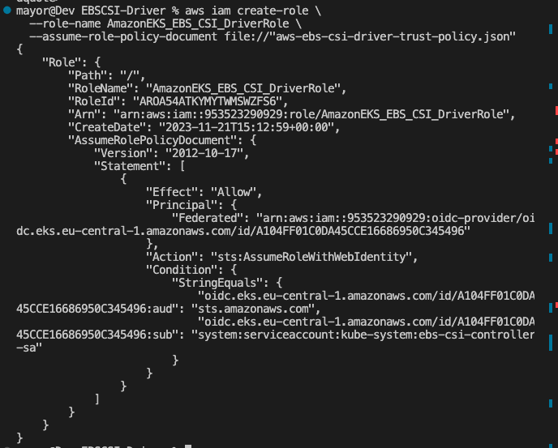
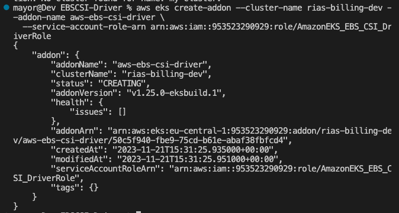

# Demystifying AWS EBS CSI Driver in Kubernetes

## Introduction

Container Storage Interface (CSI) is a standardized interface for container orchestration platforms to access storage plugins. 
Efficient storage management is critical for seamless operations in the world of containerized applications,
AWS EBS CSI Driver enables seamless integration between Amazon Elastic Block Store (EBS) and Kubernetes, allowing users to dynamically provision and manage EBS volumes.

## Key Features

1. Dynamic Volume Provisioning

- AWS EBS CSI Driver allows dynamic provisioning of EBS volumes based on the storage class specifications in Kubernetes

2. Elasticity and Scalability

- Leverage the elasticity and scalability of AWS EBS to meet the storage demands of your Kubernetes workloads.

3. Volume Snapshotting

- Capture point-in-time snapshots of EBS volumes for data backup and recovery purposes.

4. Cross-Availability Zone (Cross-AZ) Support

- Deploy applications that require high availability by utilizing EBS volumes across multiple Availability Zones

## How to Configure AWS EBS CSI Driver

**Prerequisites**

An existing Amazon EKS cluster

For this project we will go through the process of **Dynamic Provisioning** - Automatically create EBS volumes and associated [PersistentVolumes](https://kubernetes.io/docs/concepts/storage/persistent-volumes/) (PV) from [PersistentVolumeClaims](https://kubernetes.io/docs/concepts/storage/persistent-volumes/#dynamic) (PVC). Parameters can be passed via a StorageClass for fine-grained control over volume creation.

STEPS

1. IAM Role Setup:

Create an IAM role with the necessary permissions for the EBS CSI Driver to interact with EBS volumes.
The Amazon EBS CSI plugin requires IAM permissions to make calls to AWS APIs on your behalf. The
The example [policy](https://github.com/kubernetes-sigs/aws-ebs-csi-driver/blob/master/docs/example-iam-policy.json) can be used to define the required permissions. Additionally, AWS provides a managed policy at ARN
`arn:aws:iam::aws:policy/service-role/AmazonEBSCSIDriverPolicy` which we will make use here.

2. Create an IAM OIDC provider for your cluster using the AWS CLI.

a. Determine the OIDC issuer ID for your cluster;
Retrieve your cluster's OIDC issuer ID and store it in a variable. Replace my-cluster with your own value.

```
cluster_name=my-cluster

oidc_id=$(aws eks describe-cluster --name $cluster_name --query "cluster.identity.oidc.issuer" --output text | cut -d '/' -f 5)

echo $oidc_id
```

b. Determine whether an IAM OIDC provider with your cluster's issuer ID is already in your account.

```aws iam list-open-id-connect-providers | grep $oidc_id | cut -d "/" -f4```

If output is returned, then you already have an IAM OIDC provider for your cluster and you can skip the next step. If no output is returned, then you must create an IAM OIDC provider for your cluster.

c. Create an IAM OIDC identity provider for your cluster with the following command.

```eksctl utils associate-iam-oidc-provider --cluster $cluster_name --approve```



3. Create your Amazon EBS CSI plugin IAM role with the AWS CLI

a. View your cluster's OIDC provider URL. Replace my-cluster with your cluster name. If the output from the command is None, review 1 and 2 above

`aws eks describe-cluster --name my-cluster --query "cluster.identity.oidc.issuer" --output text`

An example output is as follows.


b. Create the IAM role, granting the AssumeRoleWithWebIdentity action.

i. Copy the following contents to a file that's named `aws-ebs-csi-driver-trust-policy.json`. Replace 111122223333 with your account ID. Replace EXAMPLED539D4633E53DE1B71EXAMPLE and region-code with the values returned in the previous step. If your cluster is in the AWS GovCloud (US-East) or AWS GovCloud (US-West) AWS Regions, then replace arn:aws: with arn:aws-us-gov:.

```
{
  "Version": "2012-10-17",
  "Statement": [
    {
      "Effect": "Allow",
      "Principal": {
        "Federated": "arn:aws:iam::111122223333:oidc-provider/oidc.eks.region-code.amazonaws.com/id/EXAMPLED539D4633E53DE1B71EXAMPLE"
      },
      "Action": "sts:AssumeRoleWithWebIdentity",
      "Condition": {
        "StringEquals": {
          "oidc.eks.region-code.amazonaws.com/id/EXAMPLED539D4633E53DE1B71EXAMPLE:aud": "sts.amazonaws.com",
          "oidc.eks.region-code.amazonaws.com/id/EXAMPLED539D4633E53DE1B71EXAMPLE:sub": "system:serviceaccount:kube-system:ebs-csi-controller-sa"
        }
      }
    }
  ]
}
```

    ii. Create the role. You can change AmazonEKS_EBS_CSI_DriverRole to a different name. If you change it, make sure to change it in later steps.

```
aws iam create-role \
  --role-name AmazonEKS_EBS_CSI_DriverRole \
  --assume-role-policy-document file://"aws-ebs-csi-driver-trust-policy.json"
```



    c. Attach a policy. AWS maintains an AWS managed policy or you can create your own custom policy. Attach the AWS managed policy to the role with the following command. If your cluster is in the AWS GovCloud (US-East) or AWS GovCloud (US-West) AWS Regions, then replace arn:aws: with arn:aws-us-gov:.

```
aws iam attach-role-policy \
  --policy-arn arn:aws:iam::aws:policy/service-role/AmazonEBSCSIDriverPolicy \
  --role-name AmazonEKS_EBS_CSI_DriverRole
```

4. Managing the Amazon EBS CSI driver as an Amazon EKS add-on

To add the Amazon EBS CSI add-on using the AWS CLI

Run the following command. Replace my-cluster with the name of your cluster, 111122223333 with your account ID, and AmazonEKS_EBS_CSI_DriverRole with the name of the role that was created earlier. If your cluster is in the AWS GovCloud (US-East) or AWS GovCloud (US-West) AWS Regions, then replace arn:aws: with arn:aws-us-gov:.

```
aws eks create-addon --cluster-name my-cluster --addon-name aws-ebs-csi-driver \
  --service-account-role-arn arn:aws:iam::953523290929:role/AmazonEKS_EBS_CSI_DriverRole
```



Follow procedures in this [link](https://docs.aws.amazon.com/eks/latest/userguide/ebs-sample-app.html) to complete the configuration.

## Conclusion

AWS EBS CSI Driver simplifies storage management for Kubernetes workloads by integrating seamlessly with Amazon EBS. Whether you're running stateful applications or database workloads, the AWS EBS CSI Driver provides the flexibility and scalability needed for your containerized environment.
Storage management becomes more efficient, enabling administrators to provision, expand, and manage resources effectively in their AWS Kubernetes environment. Embracing the EBS CSI driver unlocks the full potential of AWS's Elastic Block Store, facilitating smoother operations and enhanced scalability for containerized applications.